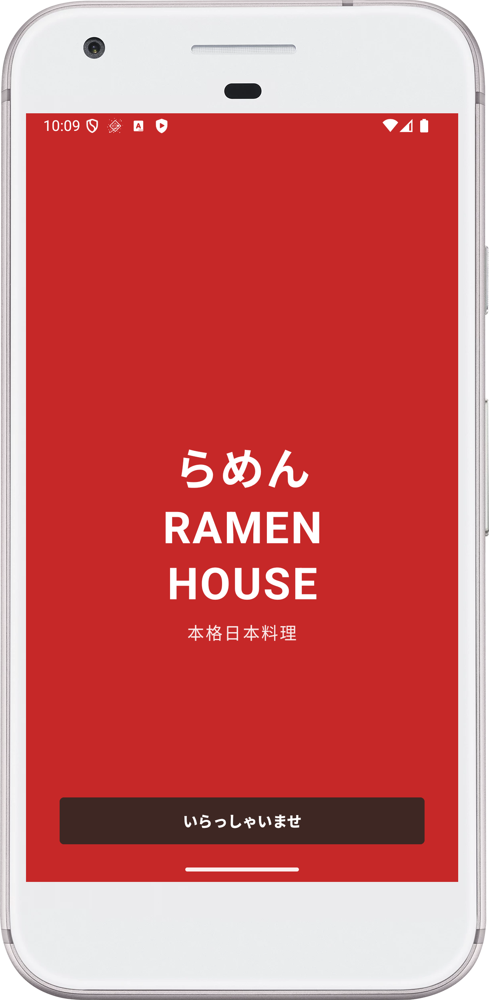
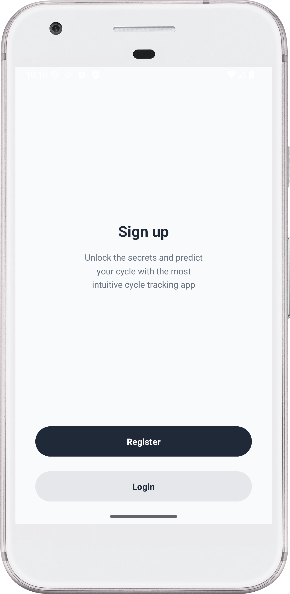
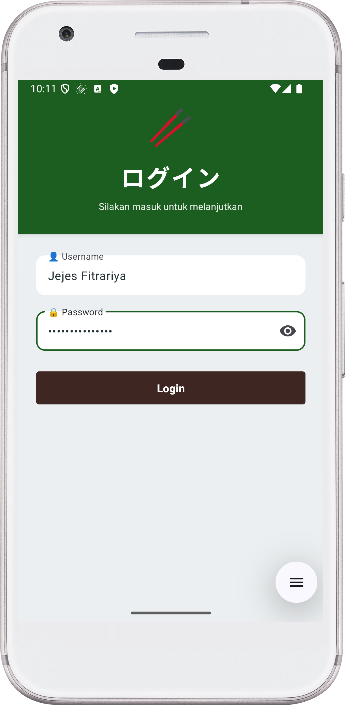
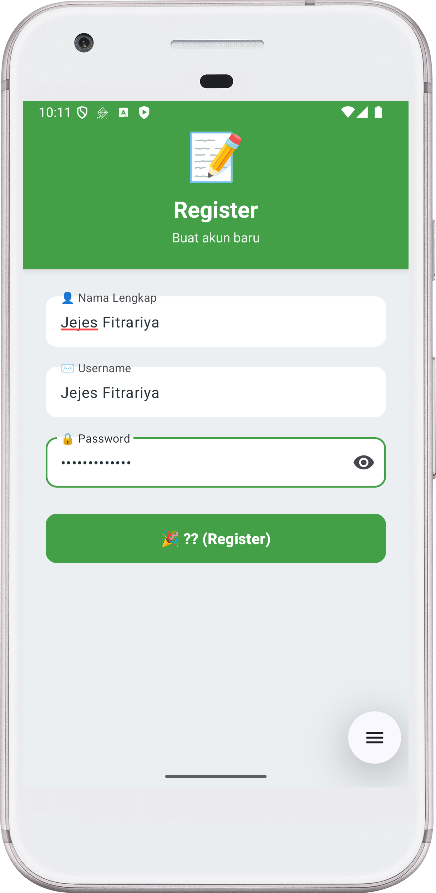
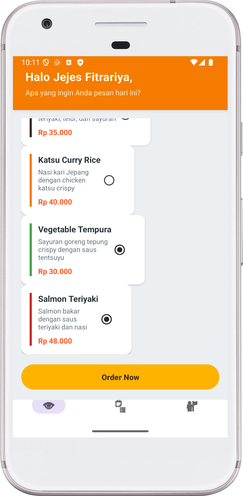
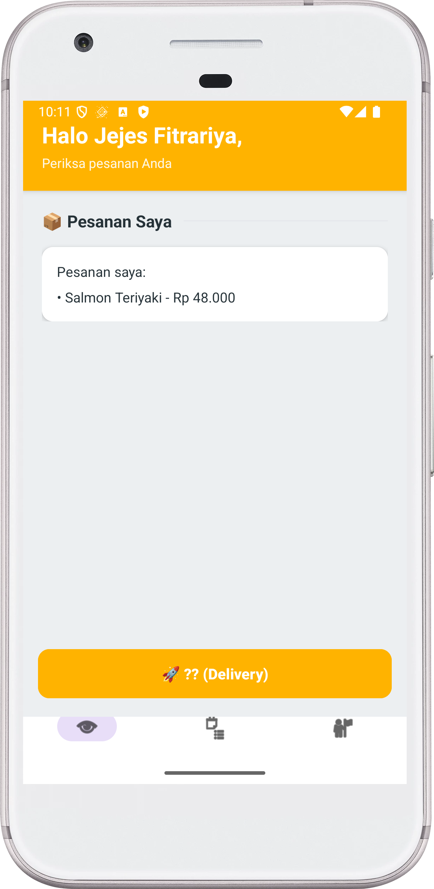

# 🍜 らめん RAMEN HOUSE - Japanese Noodle Restaurant App

Aplikasi Android untuk memesan ramen dan makanan Jepang autentik dengan desain yang clean, minimalist, dan Japanese-inspired. Dibangun menggunakan Kotlin dan View Binding.

## 📱 Tentang Aplikasi

**Ramen House** (らめん) adalah aplikasi mobile yang memudahkan pengguna untuk memesan berbagai jenis ramen autentik Jepang, gyoza, karaage, dan makanan Jepang lainnya dengan tampilan yang elegant dan user-friendly. Aplikasi ini menampilkan 12 menu item dengan informasi lengkap termasuk nama, deskripsi, dan harga.

## ✨ Fitur Utama

- ✅ **Autentikasi User** - Login dan Register
- ✅ **12 Menu Japanese Food** - Ramen, gyoza, teriyaki, dan lainnya
- ✅ **Review Pesanan** - Lihat detail pesanan sebelum checkout
- ✅ **Input Alamat** - Form alamat pengiriman lengkap
- ✅ **Konfirmasi Order** - Notifikasi sukses setelah order
- ✅ **Bottom Navigation** - Navigasi mudah antar halaman
- ✅ **Desain Clean & Minimal** - UI/UX yang elegant dengan Japanese aesthetic
- ✅ **Material Design** - Menggunakan Material Components
- ✅ **Bilingual Interface** - Japanese & Indonesian text

## 📸 Screenshot Aplikasi

Berikut dokumentasi aplikasi yang berhasil dijalankan:

### 1. Splash Screen



- Background ramen red dengan emoji ramen 🍜
- Judul bilingual "らめん RAMEN HOUSE"
- Subtitle dalam kanji Jepang "本格日本料理" (Authentic Japanese Cuisine)
- Tombol "いらっしゃいませ" (Irasshaimase - Welcome)
- **Gaya Desain**: Clean & Minimal dengan Japanese typography

### 2. Auth Choice



- Pilihan untuk Register atau Login
- Deskripsi singkat aplikasi
- Tombol berbeda warna untuk setiap pilihan

### 3. Login



- Header nori green dengan emoji chopsticks 🥢
- Judul dalam kanji "ログイン" (Login)
- Subtitle "Silakan masuk untuk melanjutkan"
- Form login dengan username dan password
- Material TextInputLayout dengan ikon
- Password toggle untuk show/hide password
- Tombol "ログイン (Login)" bilingual
- **Perbedaan Desain**: Japanese characters, minimalist spacing, clean layout

### 4. Register



- Header wasabi green dengan emoji 📝
- Subtitle "Buat akun baru"
- Form registrasi lengkap (Nama, Username, Password)
- Material Design Components
- Tombol "登録 (Register)" dengan wasabi green
- **Perbedaan Desain**: Japanese text dengan terjemahan

### 5. Home - Menu List



- Header miso orange dengan greeting "こんにちは、Nazwa" (Konnichiwa)
- Subtitle "Apa yang ingin Anda pesan hari ini?"
- Section title "🍜 Menu Ramen"
- 12 menu item Japanese food dalam card elegant:
  - Tonkotsu Ramen - Rp 42.000
  - Shoyu Ramen - Rp 38.000
  - Miso Ramen - Rp 40.000
  - Spicy Tan Tan Men - Rp 45.000
  - Chicken Karaage - Rp 28.000
  - Gyoza 6pcs - Rp 25.000
  - Yakitori Set - Rp 32.000
  - Edamame - Rp 18.000
  - Chicken Teriyaki Don - Rp 35.000
  - Katsu Curry Rice - Rp 40.000
  - Vegetable Tempura - Rp 30.000
  - Salmon Teriyaki - Rp 48.000
- Setiap card menampilkan nama, deskripsi, harga, dan indikator warna
- RadioButton terintegrasi dalam card
- Bottom Navigation Bar (Home, Order, Profile)
- **Perbedaan Desain**: Tombol "注文する (Order)" dengan warna egg yolk

### 6. Order Review



- Header egg yolk dengan informasi user
- Subtitle "Periksa pesanan Anda"
- Card putih menampilkan pesanan yang dipilih
- Tombol "配達 (Delivery)" dengan warna kuning telur
- Bottom Navigation Bar
- **Perbedaan UX**: Bahasa formal dengan Japanese characters

### 7. Delivery Address


- Header soy sauce dark dengan greeting personal
- Subtitle "Alamat pengiriman"
- Form input alamat lengkap:
  - 👤 Nama Penerima
  - 🏠 Alamat Lengkap
  - 🗺️ Patokan Alamat
- Material TextInputLayout dengan ikon
- Tombol "確認 (Confirm)" dengan warna soy sauce
- **Perbedaan Desain**: Minimalist dengan dark earthy tones

> **Catatan**: Aplikasi telah dijalankan dengan sukses dan semua fitur telah diuji. Screenshot di atas adalah bukti bahwa aplikasi berjalan dengan baik.

## 🛠️ Teknologi yang Digunakan

- **Language**: Kotlin
- **SDK**: Android SDK (Min SDK 24, Target SDK 36)
- **Build Tool**: Gradle 8.13
- **Architecture Pattern**: MVVM (Model-View-ViewModel)
- **UI Components**:
  - View Binding
  - Material Design Components
  - ConstraintLayout
  - ScrollView
  - Material TextInputLayout
  - Material CardView
  - Bottom Navigation View

## 📁 Struktur Project

```
PraktikumWireframe/
├── app/
│   ├── src/
│   │   ├── main/
│   │   │   ├── java/com/example/praktikumwireframe/
│   │   │   │   ├── SplashActivity.kt          # Splash screen
│   │   │   │   ├── AuthChoiceActivity.kt      # Auth choice
│   │   │   │   ├── LoginActivity.kt           # Login
│   │   │   │   ├── RegisterActivity.kt        # Register
│   │   │   │   ├── HomeActivity.kt            # Menu list
│   │   │   │   ├── OrderReviewActivity.kt     # Order review
│   │   │   │   ├── AddressActivity.kt         # Address input
│   │   │   │   ├── ConfirmActivity.kt         # Confirmation
│   │   │   │   ├── FoodItem.kt                # Menu data class
│   │   │   │   └── OrderData.kt               # Order singleton
│   │   │   ├── res/
│   │   │   │   ├── layout/                    # Layout files
│   │   │   │   ├── values/
│   │   │   │   │   ├── colors.xml             # Color definitions
│   │   │   │   │   └── strings.xml
│   │   │   │   ├── menu/
│   │   │   │   │   └── menu_bottom.xml
│   │   │   │   └── drawable/
│   │   │   └── AndroidManifest.xml
│   │   └── build.gradle.kts
│   └── ...
├── screenshot/                                 # Screenshot folder (7 files)
│   ├── 01_splash.png
│   ├── 02_auth_choice.png
│   ├── 03_login.png
│   ├── 04_register.png
│   ├── 05_home.png
│   ├── 06_order_review.png
│   └── 07_address.png
└── README.md
```

## 🎨 Skema Warna

Aplikasi menggunakan skema warna yang terinspirasi dari makanan dan budaya Jepang:

- **Ramen Red**: `#C62828` - Merah hangat untuk header splash & confirm
- **Soy Sauce**: `#3E2723` - Cokelat gelap untuk button & address
- **Miso**: `#F57C00` - Orange hangat untuk home header
- **Nori Green**: `#1B5E20` - Hijau gelap untuk login
- **Egg Yolk**: `#FFB300` - Kuning telur untuk order review & button
- **Dashi**: `#EFEBE9` - Cream lembut untuk background
- **Wasabi Green**: `#43A047` - Hijau wasabi untuk register

## 🎯 Filosofi Desain

### Fitur Unik Version 5:

1. **Japanese Typography**

   - Hiragana & Kanji characters (らめん, ログイン, 注文する, 確認)
   - Clean Japanese aesthetic
   - Bilingual text (Japanese + Indonesian)
   - Moderate letter spacing (0.04-0.06)

2. **Minimalist Button Design**

   - Small corner radius (4dp) untuk kesan clean
   - Height 52dp untuk proportional sizing
   - `textAllCaps="false"` untuk refined look
   - Muted color palette

3. **Color Psychology (Japanese Inspired)**

   - Earthy tones (brown, green) untuk natural feel
   - Red untuk warmth & appetite
   - Dark colors untuk sophistication
   - Muted yellow untuk accent

4. **UX yang Refined & Polite**

   - Bahasa formal dan sopan
   - Japanese greetings (こんにちは, いらっしゃいませ)
   - Clean layout dengan white space
   - Minimalist emoji usage (🍜, 🥢)

5. **Authentic Japanese Feel**
   - Kanji & Hiragana integration
   - Traditional Japanese color palette
   - Clean and organized layout
   - Respectful and formal tone

## 🚀 Cara Menjalankan

### Prerequisites

- Android Studio Arctic Fox atau lebih baru
- JDK 11 atau lebih tinggi
- Android SDK dengan API Level 24 atau lebih tinggi
- Android emulator atau physical device

### Langkah-langkah

1. **Clone Repository**

   ```bash
   git clone https://github.com/hilmanmaulana1237/UTS_HilmanMaulana_PAM.git
   cd PraktikumWireframe
   ```

2. **Buka di Android Studio**

   - Buka Android Studio
   - File → Open → Pilih folder project
   - Tunggu Gradle sync selesai

3. **Build Project**

   ```bash
   ./gradlew build
   ```

   atau melalui Android Studio: Build → Make Project

4. **Run Application**
   - Pilih device/emulator
   - Klik tombol Run (▶️) atau Shift+F10
   - Aplikasi akan terinstall dan berjalan

## 📦 Komponen Utama

### Data Classes

**FoodItem.kt**

```kotlin
data class FoodItem(
    val id: Int,
    val name: String,
    val description: String,
    val price: String,
    val colorRes: Int
)
```

**OrderData.kt** - Singleton untuk penyimpanan data order

```kotlin
object OrderData {
    var namaUser: String = ""
    val makananDipilih = mutableListOf<String>()
    var namaPenerima: String = ""
    var alamat: String = ""
    var patokan: String = ""
}
```

### Activities

1. **SplashActivity** - Landing page dengan branding Japanese
2. **AuthChoiceActivity** - Pilihan Login/Register
3. **LoginActivity** - Autentikasi user
4. **RegisterActivity** - Registrasi user baru
5. **HomeActivity** - Tampilkan 12 menu item
6. **OrderReviewActivity** - Review sebelum checkout
7. **AddressActivity** - Input alamat pengiriman
8. **ConfirmActivity** - Konfirmasi pesanan sukses

## 🎯 Alur Aplikasi

```
Splash Screen (らめん Ramen House)
    ↓
Auth Choice (Register/Login)
    ↓
Login/Register Form
    ↓
Home (Pilih Ramen/Japanese Food)
    ↓
Order Review
    ↓
Input Alamat
    ↓
Konfirmasi
    ↓
Kembali ke Home
```

## 💡 Fitur Khusus

### 1. Menu Japanese Food Autentik

- Menu ramen dan Japanese food di-generate dinamis dari FoodData
- Setiap item punya indikator warna berbeda
- Range harga Rp 18.000 - Rp 48.000
- Nama autentik dan deskripsi detail

### 2. Material Design yang Clean

- TextInputLayout dengan ikon dan animated hints
- Password toggle untuk show/hide
- CardView dengan elevation dan rounded corners
- Bottom Navigation dengan custom styling
- Typography clean dengan moderate letter spacing

### 3. Data Persistence

- Menggunakan Singleton pattern untuk OrderData
- Data user dan pesanan tersimpan selama sesi

### 4. User Experience yang Superior

- Greeting personal di setiap halaman (bilingual)
- Notifikasi Toast untuk validasi
- Alur navigasi yang smooth
- Desain responsif dengan tema Japanese yang konsisten
- Bahasa formal dan sopan
- Palet warna earthy dan natural
- Spacing dan padding yang balanced

### 5. Japanese Cultural Integration

- Kanji characters untuk authenticity (ログイン, 注文する, 確認)
- Traditional Japanese greetings (いらっしゃいませ, こんにちは)
- Japanese cuisine-inspired color palette
- Clean and minimal aesthetic following Japanese design principles

## 📝 Dependencies

```kotlin
dependencies {
    implementation(libs.androidx.core.ktx)
    implementation(libs.androidx.appcompat)
    implementation(libs.material)
    implementation(libs.androidx.activity)
    implementation(libs.androidx.constraintlayout)
}
```

## 👨‍💻 Developer

- **Nama**: Hilman Maulana
- **Repository**: UTS_HilmanMaulana_PAM
- **GitHub**: hilmanmaulana1237
- **Mata Kuliah**: Pemrograman Aplikasi Mobile

## 📄 Build Status

✅ **Build Successful** - Aplikasi berhasil dikompilasi dan dijalankan
✅ **All Features Working** - Semua fitur berfungsi dengan baik
✅ **Screenshots Documented** - 7 screenshot tersedia di folder `/screenshot`
✅ **Clean Design** - UI/UX yang elegant dan minimalist

## 🔄 Perbandingan Versi

**Version 5 vs Versi Sebelumnya:**

- ✨ Desain paling clean dan minimalist
- ✨ Palet warna earthy & natural (brown, green, muted tones)
- ✨ Typography dengan Japanese characters (Kanji & Hiragana)
- ✨ Button kecil (52dp) dengan corner radius minimal (4dp)
- ✨ Bilingual text (Japanese + Indonesian)
- ✨ Tema Japanese Ramen & Cuisine
- ✨ Emoji minimal dan purposeful (🍜, 🥢)
- ✨ Formal & polite language tone
- ✨ White space yang generous untuk breathing room

## 🇯🇵 Japanese Elements

### Kanji & Hiragana Used:

- **らめん** (Ramen) - Hiragana untuk ramen
- **本格日本料理** (Honkaku Nihon Ryōri) - Authentic Japanese Cuisine
- **いらっしゃいませ** (Irasshaimase) - Welcome (formal greeting)
- **こんにちは** (Konnichiwa) - Hello
- **ログイン** (Login) - Login
- **登録** (Tōroku) - Registration
- **注文する** (Chūmon suru) - To Order
- **配達** (Haitatsu) - Delivery
- **確認** (Kakunin) - Confirmation
- **ホーム** (Hōmu) - Home

### Color Inspiration:

Colors inspired by traditional Japanese cuisine ingredients:

- Ramen broth (red)
- Soy sauce (dark brown)
- Miso paste (orange)
- Nori seaweed (dark green)
- Egg yolk (yellow)
- Dashi broth (cream)
- Wasabi (green)

## 🙏 Terima Kasih

Terima kasih kepada:

- Dosen mata kuliah Pemrograman Aplikasi Mobile
- Teman-teman yang telah membantu
- Referensi Material Design dari Google
- Japanese culture and cuisine inspiration

---

**© 2025 らめん Ramen House - Japanese Noodle Restaurant**

_Dibuat dengan ❤️ menggunakan Kotlin & Material Design_

_いただきます (Itadakimasu) - Let's eat!_

_Build Date: 31 Oktober 2025_
